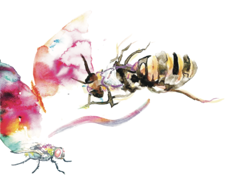
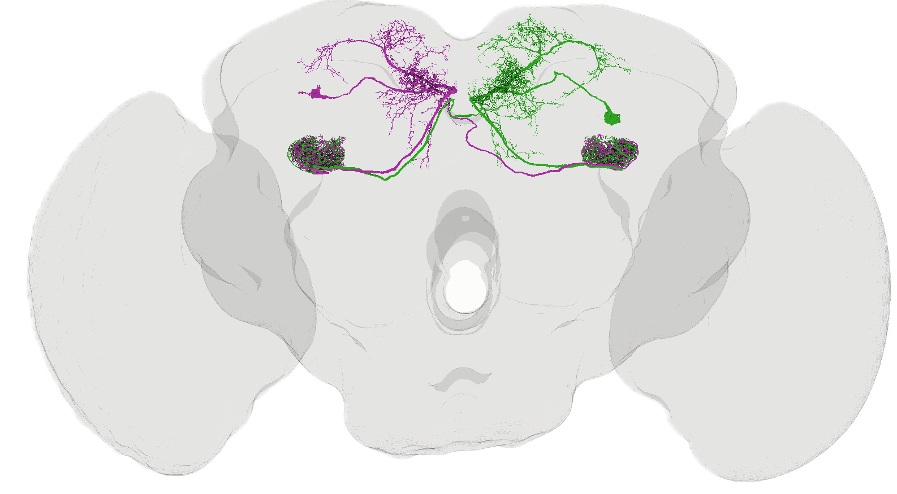

  

  <h1 align="center">SBBI 2026 — Connectome Practical</h1>

  

 

**Small Brains, Big Ideas 2026**

Practical materials for exploring, analysing, and visualising connectomes using *Drosophila melanogaster* datasets.

This repository accompanies the connectomics practical of the **Small Brains, Big Ideas 2026 EMBO course**. The aim is to introduce available connectome resources and provide hands-on experience navigating connectomic datasets, identifying neurons and circuits, analysing connectivity, and visualising neuronal morphology (meshes and skeletons).

  

  <em>
    Example of neuronal meshes visualised using <strong>Coda</strong> and the
    <strong>male CNS connectome dataset</strong>. Left and right PPL101
    dopaminergic neurons are shown in green and magenta, respectively.
  </em>

---

## Learning objectives

By the end of the practical, you should be able to:

- Navigate major *Drosophila* connectome datasets.
- Search for neurons and inspect their connectivity.
- Identify upstream and downstream partners of a neuron.
- Explore neuronal morphology and connectivity using online tools.
- Perform basic circuit analyses and visualisations.
- Know where to find documentation, datasets, and analysis tools for your own projects.

---

## Connectome resources

- Codex ->  Explore neurons and connectivity (FAFB, BANC, maleCNS, others) https://codex.flywire.ai/
- neuPrint -> Explore neurons and connectivity (hemibrain, maleCNS, others) https://neuprint.janelia.org/
- Virtual Fly Brain -> Integrate anatomy, genetics and connectomics https://www.virtualflybrain.org/
- CODA ->  Circuit analysis and neuronal visualisation https://coda.science/
- Natverse (R) -> R ecosystem for accessing, analysing and visualising neuroanatomical and connectomic data https://natverse.org/
- NAVis (Python) -> Python library for neuronal morphology analysis and visualisation; the Python counterpart to the natverse ecosystem https://navis-org.github.io/navis/

---

## Practical curated datasets

To minimise dependence on internet connectivity during the course, we will use **curated datasets prepared in advance** for some exercises for this course.

📁 **Download practical datasets here:**  `https://www.dropbox.com/scl/fo/qoui26oplmpmoqyt2mvuv/AM0kPfZXAeSkbFlS_A-mHso?rlkey=5u15cn0ltztsvy0o9skuzo7rf&st=hja1bn8z&dl=0`

Please download the datasets **before the practical session**.

---

## 🚧 Repository status

This repository is currently under development.

Materials, datasets, notebooks, and exercises will be updated before **Small Brains, Big Ideas 2026**.

---

## 📖 Citation

For publication purposes please cite the original connectome datasets and software used in your analyses.
Dataset-specific references and recommended citations will be provided alongside each practical exercise.

